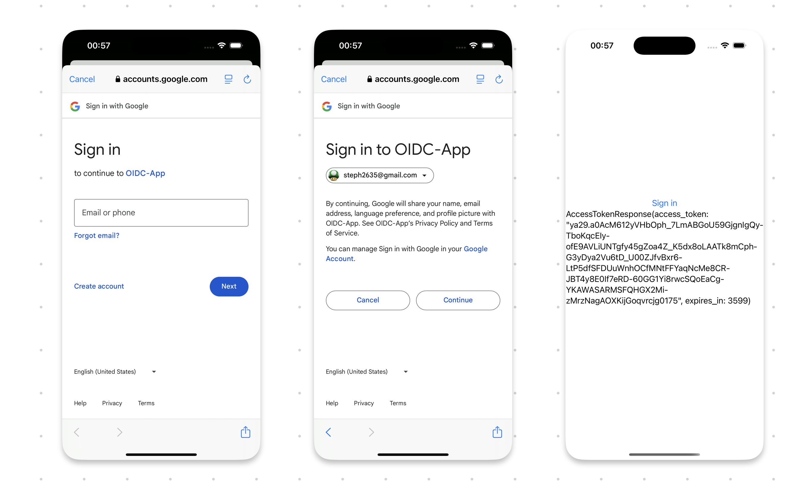

#  Implementing OAuth2 + PKCE on iOS using Google API

iOS App showcasing communication with OAuth 2.0 / OpenID Connect providers.

1. It follows the best practices set out in [RFC 8252 - OAuth 2.0 for Native Apps](https://datatracker.ietf.org/doc/html/rfc8252) including using SwiftUI' s [WebAuthenticationSession](https://developer.apple.com/documentation/authenticationservices/webauthenticationsession) for the auth request. 

2. Embedding WebView is explicitly not supported due to the security and usability reasons explained in [Section 8.12 of RFC 8252](https://datatracker.ietf.org/doc/html/rfc8252#section-8.12).

3. It also supports the PKCE extension defined in [RFC-7636 - Proof Key for Code Exchange by OAuth Public Clients](https://datatracker.ietf.org/doc/html/rfc7636), which was created to secure authorization codes in public clients when custom URI scheme redirects are used.

4. When adding multi-factor authentication (MFA) over OpenID Connect (OIDC), it should generally be implemented in the login webpage. This ensures that the sensitive process of verifying an additional authentication factor, such as a one-time password (OTP), is managed in a secure and centralized environment. OIDC is designed to separate the concerns of authentication and resource access.

### References
- [Create authorization credentials for Google APIs](https://developers.google.com/identity/protocols/oauth2/native-app#ios)
- [Use a web authentication session to authenticate a user in your app](https://developer.apple.com/documentation/authenticationservices/authenticating-a-user-through-a-web-service)

